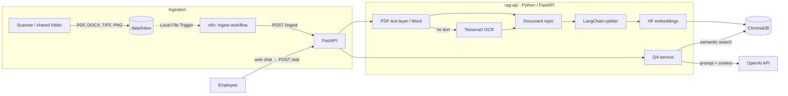

# RAG Support Assistant

**English** · [Українська](README.uk.md)

[](https://github.com/mmoskovchuk/rag-support-assistant/actions/workflows/ci.yml)
[](LICENSE)


A self-hosted RAG (Retrieval-Augmented Generation) assistant for internal employee support. Company documents (scanned paper, digital PDFs and Word files) are indexed automatically into a vector database, and employees ask questions in a simple web chat. The LLM answers **only** from the retrieved fragments and cites its sources. When the knowledge base has no answer, the assistant does not make one up: it politely suggests up to 5 document topics worth looking into.


> The demo documents and the UI are in Ukrainian, the primary language of the target company. Questions in English work too: the embedding model is multilingual and the LLM answers in the language of the question.

## Highlights

- **Any document type:** scans (Tesseract OCR), digital PDFs (text layer, no OCR; decided page by page), Word files including tables.
- **Grounded answers with citations:** every fact is cited as `[file, p. N]`; the model is instructed to use the context only.
- **Two layers against hallucinations:** a relevance threshold filters out irrelevant context without calling the LLM, and the LLM replies `NO_ANSWER` when the context does not contain the answer.
- **A useful "not found":** instead of a bare refusal, the closest document topics are suggested; topics are generated by the LLM once, at ingestion time.
- **Automatic ingestion with n8n:** a file-added event plus periodic reconciliation, so no file is ever left behind.
- **Data-loss protection:** atomic file moves, crash recovery, idempotent indexing, and a no-OCR index rebuild (`/reindex`) that swaps collections only after success.
- **Measured, not guessed:** the embedding model and chunk size were chosen by comparing 4 models ([experiment](docs/experiments.md)): 7/7 correct answers versus 5/7 with the initial setup.

## Architecture



## Tech stack

| Layer | Technology | Why |
|---|---|---|
| Orchestration | n8n 2.x | folder watching and ingestion triggers without code |
| API + UI | Python 3.12, FastAPI, vanilla HTML/JS | HTTP API for n8n and a web chat with no frontend build |
| Text extraction | pypdf, python-docx | exact text from digital PDFs and Word, no OCR |
| OCR | Tesseract (`ukr+eng`), Poppler | printed text from scans |
| RAG | LangChain | text splitting, prompts, integrations |
| Embeddings | Hugging Face `BAAI/bge-m3` | local and free; best of 4 models tested ([experiment](docs/experiments.md)) |
| Vector DB | ChromaDB 1.5 | local storage of vectors and metadata |
| LLM | OpenAI API | answer generation and document topic naming |
| Infrastructure | Docker Compose | the whole stack with one command |

## Quick start

```bash
cp .env.example .env          # fill in the secrets
docker compose up -d --build  # first run: ~5–10 min (image build + model download)
curl http://localhost:8100/health
```

Web chat: http://localhost:8100 (enter `API_KEY` from `.env` on first visit).

Host ports (8100 API/web chat, 8101 ChromaDB, 5690 n8n) are configurable in `.env` via `API_HOST_PORT`, `CHROMA_HOST_PORT` and `N8N_HOST_PORT` in case they clash with other projects.

Then import or build the ingestion workflow in n8n (http://localhost:5690): the exported workflow is in [`n8n/workflows/ingest-documents.json`](n8n/workflows/ingest-documents.json), and a node-by-node guide is in [docs/03-n8n-workflows.md](docs/03-n8n-workflows.md).


## Demo

[`demo/documents/`](demo/documents) contains five documents of a fictional company, one for every supported processing path:

| File | Format | Processing |
|---|---|---|
| `vacation-policy.docx` | Word with a table | paragraphs and tables |
| `onboarding-guide.docx` | Word | paragraphs |
| `business-trips.pdf` | digital PDF | text layer, no OCR |
| `information-security.pdf` | digital PDF | text layer, no OCR |
| `remote-work-order-scan.jpg` | "scan" with tilt and noise | OCR (Tesseract) |

```bash
cp demo/documents/* data/inbox/
curl -X POST http://localhost:8100/ingest/pending -H "X-API-Key: $API_KEY"
```

Then open the web chat and ask, for example, "How much is the internet compensation for remote work?", «Скільки днів відпустки, якщо я працюю 4 роки?» (How many vacation days after 4 years?), or something the documents do not cover: «Чи можна привести собаку в офіс?» (Can I bring a dog to the office?).

## API

| Method | Path | Description |
|---|---|---|
| GET | `/` | web chat |
| GET | `/health` | service and ChromaDB status |
| POST | `/ingest` | `{"filename": "x.pdf"}`: process a file from `data/inbox` |
| POST | `/ingest/pending` | process everything left in `inbox` (safety net) |
| POST | `/reindex` | `{"regenerate_topics": false}`: rebuild the index from saved text, no OCR |
| POST | `/ask` | `{"question": "..."}`: an answer with sources, or `no_answer` with topic suggestions |

Every endpoint except `/` and `/health` requires the `X-API-Key` header. Interactive docs: http://localhost:8100/docs.

## Documentation

Detailed documentation is written in Ukrainian:

| File | Contents |
|---|---|
| [docs/01-architecture.md](docs/01-architecture.md) | architecture, design decisions and their rationale, data-loss protection |
| [docs/02-python-service.md](docs/02-python-service.md) | module-by-module walkthrough of the Python code |
| [docs/03-n8n-workflows.md](docs/03-n8n-workflows.md) | the n8n workflow node by node |
| [docs/04-docker.md](docs/04-docker.md) | Docker Compose and the Dockerfile explained |
| [docs/experiments.md](docs/experiments.md) | measurements: choosing the embedding model, chunk size and threshold |

## Project structure

```
rag-support-assistant/
├── app/                      # Python service (rag-api image)
│   ├── support_rag/
│   │   ├── api.py            # FastAPI: endpoints, auth, request id
│   │   ├── config.py         # all settings from env, validated
│   │   ├── logging_setup.py  # logging with a correlation id
│   │   ├── file_store.py     # inbox → processing → processed | failed
│   │   ├── extraction.py     # PDF (text layer or OCR), Word, images
│   │   ├── ocr.py            # Tesseract + Poppler
│   │   ├── topics.py         # short document topic via the LLM
│   │   ├── chunking.py       # LangChain text splitter + metadata
│   │   ├── vector_store.py   # ChromaDB + HF embeddings
│   │   ├── ingestion.py      # ingestion pipeline + reindex
│   │   ├── archive.py        # format of the .txt archive next to each original
│   │   ├── qa.py             # search → decision → LLM / topic suggestions
│   │   └── static/index.html # web chat
│   ├── tests/                # pytest, no heavy dependencies
│   ├── Dockerfile
│   └── requirements.txt
├── data/                     # runtime data (only empty folders in git)
├── demo/documents/           # fictional documents for the demo
├── docs/                     # technical documentation and experiments
├── scripts/                  # embedding model comparison script
├── n8n/workflows/            # exported n8n workflow (JSON)
├── .github/workflows/ci.yml  # ruff + pytest on every push
├── docker-compose.yml
├── .env.example
└── LICENSE
```

## Tests

```bash
cd app
python -m venv .venv && source .venv/bin/activate
pip install -r requirements-dev.txt
ruff check . ../scripts
pytest
```

GitHub Actions runs the same checks on every push ([`.github/workflows/ci.yml`](.github/workflows/ci.yml)).

## License

[MIT](LICENSE)
