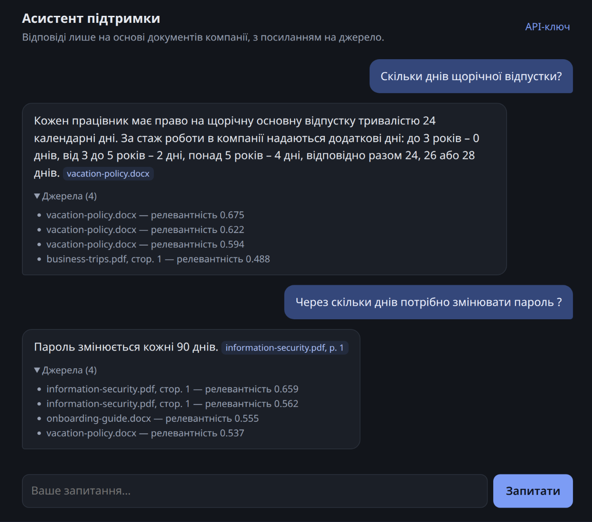
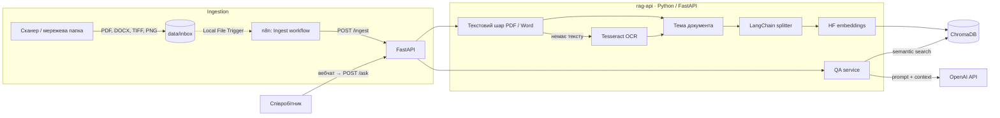
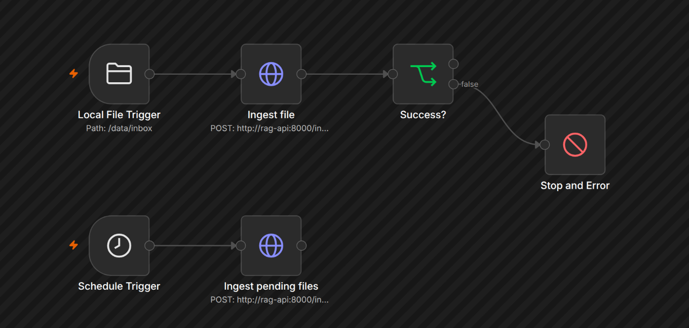

# RAG Support Assistant

[English](README.md) · **Українська**

[](https://github.com/mmoskovchuk/rag-support-assistant/actions/workflows/ci.yml)
[](LICENSE)


Локальна RAG-система для внутрішньої підтримки співробітників. Корпоративні документи (відскановані папери, звичайні PDF і Word) автоматично індексуються у векторну базу, а на запитання працівників у простому вебчаті відповідає LLM **лише** на основі знайдених фрагментів, з посиланням на джерело. Якщо відповіді немає, система не вигадує, а ввічливо пропонує до 5 тем документів, де варто пошукати.



## Ключові можливості

- **Будь-які документи:** скани (OCR Tesseract), цифрові PDF (текстовий шар без OCR, рішення посторінково), Word разом з таблицями.
- **Відповіді з джерелом:** кожен факт має посилання `[файл, стор.]`; модель відповідає лише з контексту.
- **Два рівні захисту від вигадок:** поріг релевантності відсікає нерелевантне без виклику LLM, а LLM відповідає `NO_ANSWER`, якщо в контексті відповіді немає.
- **Корисне «не знайшов»:** замість сухої відмови пропонуються найближчі теми документів, згенеровані LLM під час індексації.
- **Автоматична індексація через n8n:** подія «файл додано» + періодична звірка, тож жоден файл не губиться.
- **Захист від втрати даних:** атомарні переміщення файлів, відновлення після збою, ідемпотентна індексація, перебудова індексу без OCR (`/reindex`) з безпечною підміною колекції.
- **Рішення на основі вимірювань:** embedding-модель і розмір чанка обрано порівнянням 4 моделей ([експеримент](docs/experiments.md)): 7/7 правильних відповідей проти 5/7 у початковій конфігурації.

## Архітектура



## Стек

| Шар | Технологія | Навіщо |
|---|---|---|
| Оркестрація | n8n 2.x | моніторинг папки, запуск індексації без коду |
| API + UI | Python 3.12, FastAPI, vanilla HTML/JS | HTTP-інтерфейс для n8n і вебчат без збирання фронтенду |
| Видобування тексту | pypdf, python-docx | точний текст з цифрових PDF і Word, без OCR |
| OCR | Tesseract (`ukr+eng`), Poppler | друкований текст зі сканів |
| RAG | LangChain | розбиття тексту, промпти, інтеграції |
| Embeddings | Hugging Face `BAAI/bge-m3` | локально, безкоштовно, найкраща з 4 протестованих моделей ([експеримент](docs/experiments.md)) |
| Vector DB | ChromaDB 1.5 | локальне зберігання векторів і метаданих |
| LLM | OpenAI API | генерація відповіді та назв тем документів |
| Інфраструктура | Docker Compose | запуск усього однією командою |

## Швидкий старт

```bash
cp .env.example .env          # заповнити секрети
docker compose up -d --build  # перший запуск: ~5–10 хв (збирання образу + модель)
curl http://localhost:8100/health
```

Вебчат: http://localhost:8100 (при першому відкритті вкажіть `API_KEY` з `.env`).

Порти на хості (8100 API/вебчат, 8101 ChromaDB, 5690 n8n) задаються в `.env` змінними `API_HOST_PORT`, `CHROMA_HOST_PORT`, `N8N_HOST_PORT`, якщо вони зайняті іншими проєктами.

Далі налаштуйте workflow індексації в n8n (http://localhost:5690) за інструкцією [docs/03-n8n-workflows.md](docs/03-n8n-workflows.md).



## Демо

У [`demo/documents/`](demo/documents) лежать п'ять документів вигаданої компанії, по одному на кожен підтримуваний шлях обробки:

| Файл | Формат | Як обробляється |
|---|---|---|
| `vacation-policy.docx` | Word з таблицею | читання абзаців і таблиць |
| `onboarding-guide.docx` | Word | читання абзаців |
| `business-trips.pdf` | цифровий PDF | текстовий шар, без OCR |
| `information-security.pdf` | цифровий PDF | текстовий шар, без OCR |
| `remote-work-order-scan.jpg` | «скан» з нахилом і шумом | OCR (Tesseract) |

```bash
cp demo/documents/* data/inbox/
curl -X POST http://localhost:8100/ingest/pending -H "X-API-Key: $API_KEY"
```

Далі відкрийте вебчат і спитайте, наприклад: «Скільки днів відпустки, якщо я працюю 4 роки?», «Як часто треба змінювати пароль?», «How much is the internet compensation for remote work?» або щось, чого в документах немає: «Чи можна привести собаку в офіс?».

## API

| Метод | Шлях | Опис |
|---|---|---|
| GET | `/` | вебчат |
| GET | `/health` | стан сервісу та зв'язку з ChromaDB |
| POST | `/ingest` | `{"filename": "x.pdf"}`: обробити файл з `data/inbox` |
| POST | `/ingest/pending` | обробити все, що лишилось в `inbox` (страховка) |
| POST | `/reindex` | `{"regenerate_topics": false}`: перебудувати індекс зі збереженого тексту, без OCR |
| POST | `/ask` | `{"question": "..."}`: відповідь з джерелами або `no_answer` з підказками тем |

Усі ендпоінти, крім `/` і `/health`, вимагають заголовок `X-API-Key`. Інтерактивна документація доступна за адресою http://localhost:8100/docs.

## Документація

| Файл | Про що |
|---|---|
| [docs/01-architecture.md](docs/01-architecture.md) | архітектура, рішення та їх обґрунтування, захист від втрати даних |
| [docs/02-python-service.md](docs/02-python-service.md) | розбір Python-коду модуль за модулем |
| [docs/03-n8n-workflows.md](docs/03-n8n-workflows.md) | workflow n8n нода за нодою |
| [docs/04-docker.md](docs/04-docker.md) | Docker Compose та Dockerfile пояснено |
| [docs/experiments.md](docs/experiments.md) | вимірювання: вибір embedding-моделі, розміру чанка й порогу |

## Структура

```
rag-support-assistant/
├── app/                      # Python-сервіс (образ rag-api)
│   ├── support_rag/
│   │   ├── api.py            # FastAPI: ендпоінти, auth, request-id
│   │   ├── config.py         # усі налаштування з env + валідація
│   │   ├── logging_setup.py  # логування з correlation id
│   │   ├── file_store.py     # inbox → processing → processed | failed
│   │   ├── extraction.py     # PDF (текстовий шар або OCR), Word, зображення
│   │   ├── ocr.py            # Tesseract + Poppler
│   │   ├── topics.py         # коротка назва теми документа через LLM
│   │   ├── chunking.py       # LangChain text splitter + метадані
│   │   ├── vector_store.py   # ChromaDB + HF embeddings
│   │   ├── ingestion.py      # пайплайн індексації + reindex
│   │   ├── archive.py        # формат .txt-архіву поруч з оригіналом
│   │   ├── qa.py             # пошук → рішення → LLM / підказки тем
│   │   └── static/index.html # вебчат
│   ├── tests/                # pytest, без важких залежностей
│   ├── Dockerfile
│   └── requirements.txt
├── data/                     # runtime-дані (у git лише порожні папки)
├── demo/documents/           # вигадані документи для демонстрації
├── docs/                     # технічна документація та експерименти
├── scripts/                  # скрипт порівняння embedding-моделей
├── n8n/workflows/            # експортовані workflow (JSON)
├── .github/workflows/ci.yml  # ruff + pytest на кожен push
├── docker-compose.yml
├── .env.example
└── LICENSE
```

## Тести

```bash
cd app
python -m venv .venv && source .venv/bin/activate
pip install -r requirements-dev.txt
ruff check . ../scripts
pytest
```

Ті самі перевірки автоматично запускає GitHub Actions на кожен push ([`.github/workflows/ci.yml`](.github/workflows/ci.yml)).

## Ліцензія

[MIT](LICENSE)
