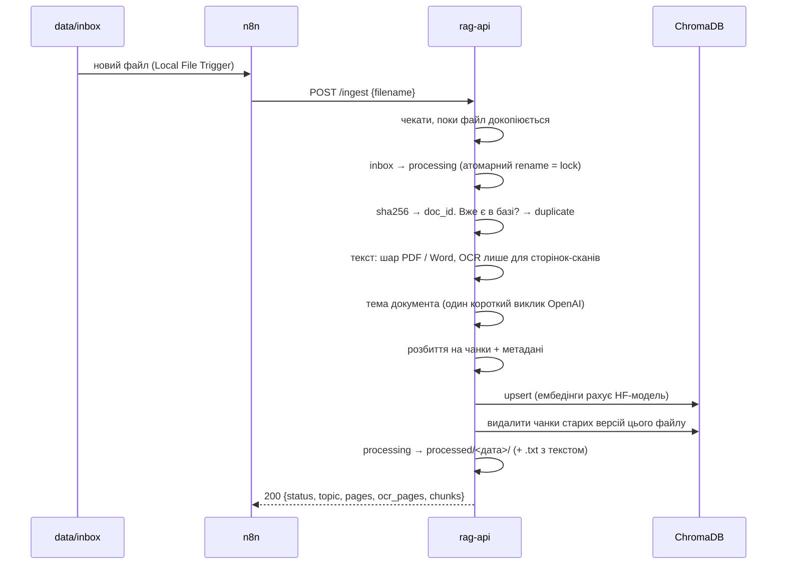
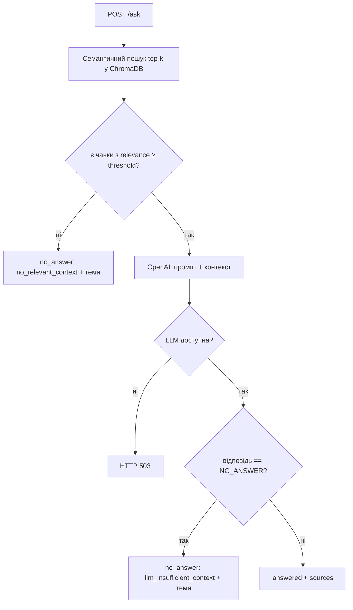

# 01. Архітектура

## Що таке RAG і навіщо він тут

**RAG (Retrieval-Augmented Generation)** — підхід, за якого LLM відповідає не «з пам'яті», а на основі документів, знайдених під конкретне питання. Три причини, чому це потрібно для корпоративної підтримки:

1. **Актуальність.** OpenAI нічого не знає про ваш наказ від минулого тижня. Новий документ стає доступним одразу після індексації, без перенавчання моделі.
2. **Перевірюваність.** Кожна відповідь має посилання `[файл, сторінка]`, тож працівник може перевірити першоджерело.
3. **Менше галюцинацій.** Модель отримує інструкцію відповідати *тільки* з контексту, а якщо контексту немає, сказати `NO_ANSWER`.

## Компоненти

| Сервіс | Контейнер | Роль |
|---|---|---|
| n8n | `n8n` | «диригент»: стежить за папкою і запускає індексацію через API |
| Python API | `rag-api` | уся «розумна» робота: OCR, чанкінг, ембедінги, пошук, LLM |
| ChromaDB | `chromadb` | зберігає вектори та метадані |
| OpenAI | зовнішній | генерує текст відповіді |

## Потік 1: індексація документа

У разі помилки на будь-якому кроці файл переїжджає в `failed/` разом з `.error.json`, а n8n отримує HTTP 422.

## Потік 2: запитання співробітника

**Relevance** — косинусна подібність між вектором питання і вектором чанка (від 0 до 1). Поріг `RELEVANCE_THRESHOLD=0.45` є стартовим значенням: його треба підібрати на своїх даних (наприклад, задати набір питань з відповіддю і без та подивитись на розподіл `relevance`).

Чому дві перевірки (поріг + `NO_ANSWER`)? Поріг відсікає очевидно нерелевантне дешево, без виклику LLM. Але чанк може бути *схожим за темою*, хоча відповіді на конкретне питання в ньому немає. Це і ловить друга перевірка.

### Коли відповіді немає

Працівник отримує не сухе «не знайдено», а ввічливе повідомлення і до 5 **тем** документів, найближчих до його запитання:

> На жаль, у базі знань не знайшлося відповіді на ваше запитання.
> Можливо, потрібна інформація є в документах на такі теми:
> • Порядок надання щорічної відпустки
> • Оформлення службових відряджень
>
> Спробуйте уточнити або переформулювати запитання з огляду на одну з цих тем.

Звідки теми: під час індексації LLM один раз читає початок документа і дає йому назву на 3–8 слів. Вона зберігається в метаданих кожного чанка. При запитанні пошук бере ширший пул (`SUGGESTION_POOL_K=20` чанків), з якого найкращі `TOP_K` йдуть у контекст, а з решти збираються унікальні теми в порядку близькості. Додаткового виклику LLM у цей момент немає: текст повідомлення є шаблоном (українською чи англійською, залежно від мови запитання), тому він передбачуваний, безкоштовний і миттєвий.

Для налагодження у відповіді також є `sources`: найближчі чанки з їхнім `relevance`. Це матеріал для підбору порогу.

## Ключові рішення

| Рішення | Альтернатива | Чому так |
|---|---|---|
| Спершу текстовий шар PDF, OCR лише для сторінок без нього | OCR усіх сторінок | Цифровий текст точний на 100% і в сотні разів швидший. Рішення приймається посторінково, тож змішаний PDF (надрукований текст + скановані додатки) обробляється правильно. |
| Word як одна «сторінка» без номера | конвертація в PDF (LibreOffice) | Сторінки у Word залежать від шрифтів і принтера, тож номер сторінки був би вигаданим. Цитата виглядає як `[файл.docx]`. Старий `.doc` не підтримується: його треба пересохранити в `.docx`. |
| Тема документа генерується LLM при індексації | назва файлу; кластеризація | Назви файлів зі сканера (`scan_0012.pdf`) нічого не кажуть. Один короткий виклик на документ коштує копійки; якщо OpenAI недоступний, тема береться з назви файлу і індексація не зупиняється. |
| Вебчат як один HTML-файл, який віддає FastAPI | React/Vue, Streamlit | Без збирання, без Node.js, без окремого контейнера. Для простого чату цього достатньо, а код легко прочитати повністю. |
| OCR у Python, n8n лише викликає API | OCR-нода/скрипт у n8n | В n8n немає вбудованого локального OCR. Execute Command в n8n 2.x вимкнено з міркувань безпеки. Python легше тестувати й логувати. |
| n8n передає **ім'я** файлу, а не сам файл | бінарні дані через HTTP | Файл уже лежить на спільному диску. Передача імені простіша, а сам файл не губиться при збої мережі. |
| ChromaDB окремим сервером | вбудований `PersistentClient` | Можна оглядати базу незалежно від API, а також масштабувати й оновлювати окремо. |
| `paraphrase-multilingual-MiniLM-L12-v2` | `bge-m3`, `multilingual-e5` | Легка (~470 MB), швидка на CPU, підтримує українську, не потребує префіксів. Для старту оптимальна; потужніші моделі є експериментом. |
| Tesseract | EasyOCR, PaddleOCR, хмарні OCR | Скани містять лише друкований текст, а тут Tesseract точний, легкий, без GPU. Дані не залишають сервер. |
| Синхронний `/ingest` | черга (Celery/RQ) | Для навчального проєкту та невеликого потоку документів достатньо. Черга є логічним наступним кроком масштабування. |
| Ембедінги локально, LLM в OpenAI | усе локально (Ollama) | Так вимагає технічне завдання. Зауважте, що **фрагменти документів передаються в OpenAI**. Для реальної компанії це питання до служби безпеки. |

## Захист від втрати даних

Це найважливіша нефункціональна вимога, і в коді вона реалізована на кількох рівнях:

| Ризик | Захист | Де в коді |
|---|---|---|
| Файл читається, поки ще копіюється | очікування стабільного розміру | `FileStore.wait_until_stable` |
| Два запити обробляють один файл | атомарний `rename` у `processing/` як lock | `FileStore.claim` |
| Сервіс впав посеред обробки | при старті файли з `processing/` повертаються в `inbox/` | `FileStore.recover_stale` |
| n8n пропустив подію (був вимкнений) | `POST /ingest/pending` за розкладом обробляє все, що лишилось | `api.ingest_pending` + Schedule Trigger |
| Помилка OCR | файл не видаляється, а йде в `failed/` з описом помилки | `FileStore.mark_failed` |
| Перезапис файлу з тим самим ім'ям | унікальний суфікс з часом | `FileStore._unique_path` |
| Дублікати в базі | детерміновані id чанків + перевірка sha256 | `chunking.split_pages`, `VectorStore.has_document` |
| Оновлення документа | спочатку записати нову версію, потім видалити стару | `IngestionPipeline._process` |
| Частково записаний файл | запис у temp + `fsync` + `os.replace` | `FileStore._atomic_write` |
| Треба змінити модель ембедінгів | OCR-текст збережено поруч з оригіналом | `mark_processed(... extracted_text)` |

## Безпека

- Усі порти прив'язані до `127.0.0.1`: ззовні сервера нічого не доступно без reverse proxy.
- API захищений ключем `X-API-Key` (порівняння через `secrets.compare_digest`).
- Ім'я файлу валідується (захист від path traversal `../../`).
- n8n має доступ до `inbox` **лише на читання** і не може виконувати shell-команди.
- Контейнер API працює від непривілейованого користувача.
- Секрети лише в `.env`, який не потрапляє в git.
